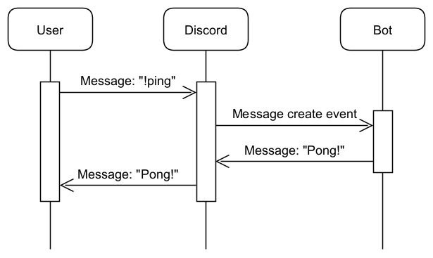
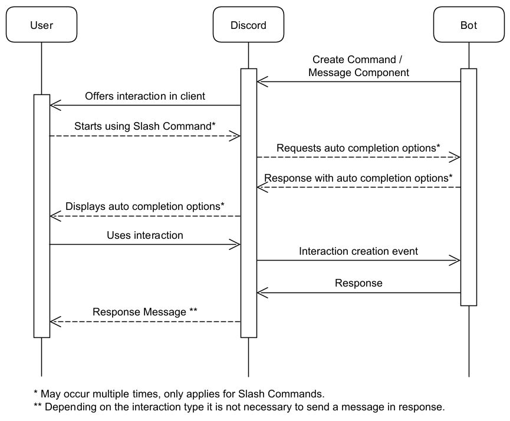

---
keywords:
- interaction
- slash command
- command
- context menu
- autocomplete
---

# Interactions

Interactions are a means of accepting user input through Discord. They have been introduced to provide a more standardized, 
controlled way for commands than parsing messages. They can even be used with applications that do not provide a bot user.

## :speech_balloon: Message Commands

The "old" way of doing commands was done through parsed text messages, like `!ping`, `!userinfo James` or 
`!mute James 100s`. While such commands are easy in theory, they come with several problems, such as:

 * Conflicts between Bots using the same command format / prefix.
 * Bots have to be able to read all messages and find those that are directed at them
 * Information about command structure can only be provided in info texts and error messages

## :envelope: Interaction Types

Interactions come in a variety of shapes. The most complex and versatile is the [command interaction](commands.md), 
which allows for commands directed at a particular bot with information and assistance on subcommands and parameters
being integrated into the discord client.

[Context Menu commands](https://javadoc.io/doc/org.javacord/javacord-api/latest/org/javacord/api/interaction/ContextMenu.html) 
are available from the context menu in the client either on a message or a server member.

[Message components](components.md) come in the flavor of buttons, select menus and other form elements and can be attached directly
to a message.

## :recycle: Lifecycle

::: tip INFO
Creation of interactions is detailed on the pages linked in the previous section.
:::

Unlike chat message commands, interactions and interaction commands need to be registered with Discord. In order for 
a bot's interactions to be available in a server, the bot must be added to the server with the `applications.commands`
OAUTH scope. The scope is included in links created by `DiscordApi#createInviteLink`. If your bot is older, it may need to 
be invited with the new link to add the scope. It is not necessary to remove the bot from the server to do this.

## :chart_with_upwards_trend: Advantages

While being more complicated to utilize, interactions have many benefits over pure text commands.

* Better Validation: Commands can not be sent with parameters of the wrong type or missing required parameters
* No conflicts: Interactions are separated by bot and only sent to the proper bot
* "Privacy": If no public response is sent by the bot, the exchange is invisible to other chat participants
* Integration: Interactions are integrated into the client's user interface
* Conversations: [Message components](components.md) can be used in replies to interactions, allowing for nested dialogues.

::: warning
If a bot replies to a slash command with a public message, the command used, including all parameters, is visible to 
other users.
:::

## :robot: Applications vs. Bots

Interactions can used by any application, not only bots. While interactions can also be handled through webhooks, 
Javacord only offers support for dealing with them through the gateway. See the 
[Discord Documentation](https://discord.com/developers/docs/interactions/receiving-and-responding) for more information.

::: warning
The methods of handling interactions can not be mixed. If you register a webhook for your interaction commands, the bot
will no longer receive any interaction events.
:::

## :mag: See also

* [Application Commands (Discord Documentation)](https://discord.com/developers/docs/interactions/application-commands)
* [Message Components (Discord Documentation)](https://discord.com/developers/docs/interactions/message-components)
