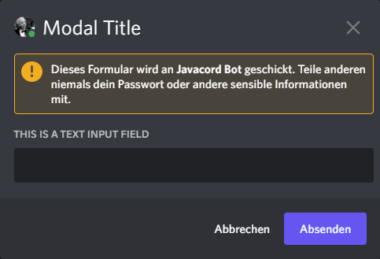

---
keywords:

- interaction responding
- modal
- autocomplete
---

# Responding to interactions

There are many ways to respond to interactions and some are only available for certain interactions.
The following will be usable for every interaction.

## :speech_balloon: Responding immediately after receiving an interaction.

```java
event.getInteraction()
        .createImmediateResponder()
        .setContent("YOUR_RESPONSE")
        .respond();
```

::: tip INFO
Note that you have to respond withing 3 seconds, or the command will fail. If you need longer than 3 seconds you have to
respond with `respondLater()` which allows you to respond within 15 minutes.

Because of this time limitation, sending any files when creating an immediate response is not possible.
If you want a file to be embedded either use `respondLater` or include a web link in the message content.
Depending on the media type of the link and the server configuration, Discord will then display an appropriate embed for the file.
:::

When you want to respond ephemerally, you can use the `setFlags` method. Your new responder would look like the
following:

```java
event.getInteraction()
        .createImmediateResponder()
        .setContent("YOUR_RESPONSE")
        .setFlags(MessageFlag.EPHEMERAL)
        .respond();
```

## :speech_balloon: Responding after some time when receiving an interaction.

If your computations takes longer than the 3 seconds limit, you can respond later and the Discord Client will show that
your bot is thinking until you respond.

```java
event.getInteraction()
        .respondLater()
        .thenAccept(interactionOriginalResponseUpdater -> {
            interactionOriginalResponseUpdater.setContent("Update message after some time").update();
        });
```

You can respond ephemerally when responding later too. For that you have pass a `true` boolean to the `respondLater` method.

```java
event.getInteraction()
        .respondLater(true)
        .thenAccept(interactionOriginalResponseUpdater -> {
            interactionOriginalResponseUpdater.setContent("Update message after some time").update();
        });
```

### Sending followup messages

Followup messages can be sent within 15 minutes after the command has been invoked. You can send as many followup
messages as you want.

``` java
api.addSlashCommandCreateListener(event -> {
    SlashCommandInteraction slashCommandInteraction = event.getSlashCommandInteraction();
    slashCommandInteraction.respondLater().thenAccept(interactionOriginalResponseUpdater -> {
        interactionOriginalResponseUpdater.setContent("You will receive the answer in a few minutes!").update();

        // time < 15 minutes
        
        slashCommandInteraction.createFollowupMessageBuilder()
                .setContent("Thank you for your patience, it took a while but the answer to the universe is 42")
                .send();
    });
});
```

## Responding with a Modal

A modal is a popup dialog which can be shown when responding to an interaction. It focuses the users to explicitly fill out this form to continue with the workflow.
Currently, only the `TextInput` (`SelectMenu` has been seen working too, but is not yet officially supported) is supported.

```java
api.addMessageComponentCreateListener(event -> {
    event.getInteraction().respondWithModal("modalId","Modal Title",
        ActionRow.of(TextInput.create(TextInputStyle.SHORT, "text_input_id", "This is a Text Input Field")));
});
```

Which results in




## :speech_balloon: SlashCommand interaction only response methods

### How to know what slash command was invoked?
For example, you have created a slash command with the name "settings" and a subcommand "color". If you want to check if
exactly this command has been used, you can check it as follows:

```java
api.addSlashCommandCreateListener(event -> {
    SlashCommandInteraction interaction = event.getSlashCommandInteraction();
    if (interaction.getFullCommandName().equals("settings color")) {
        //Code if command matches the full name
    }
});
```

### Respond to an AutoComplete interaction triggered from a SlashCommand

```java
api.addAutocompleteCreateListener(event -> {
    event.getAutocompleteInteraction()
    .respondWithChoices(Arrays.asList(
        SlashCommandOptionChoice.create("one", 1),
            SlashCommandOptionChoice.create("two", 2))
    );
});
```

## :speech_balloon: Message Component interaction only response methods

When dealing with message components, you don't necessarily have to respond or update a message. 
You can simply acknowledge the interaction and let the user know that the task is done.

```java
api.addMessageComponentCreateListener(event -> {
    event.getMessageComponentInteraction().acknowledge();
});
```
### A more complete example of how to respond to Component interactions
The following code snipped shows how you can respond to the example created in [Components](./components.md).

``` java
api.addMessageComponentCreateListener(event -> {
    MessageComponentInteraction messageComponentInteraction = event.getMessageComponentInteraction();
    String customId = messageComponentInteraction.getCustomId();

    switch (customId) {
        case "success":
            messageComponentInteraction.createImmediateResponder()
                    .setContent("You clicked a button!")
                    .respond();
            break;
        case "danger":
            messageComponentInteraction.getMessage().ifPresent(Message::delete);
            break;
        case "secondary":
            messageComponentInteraction.respondLater().thenAccept(interactionOriginalResponseUpdater -> {
                //Code to respond after 5 minutes
            });
            break;
        case "options":
            messageComponentInteraction.createImmediateResponder()
					.setContent("You selected an option in a select menu!")
					.respond();
            break;
    }
});
```
