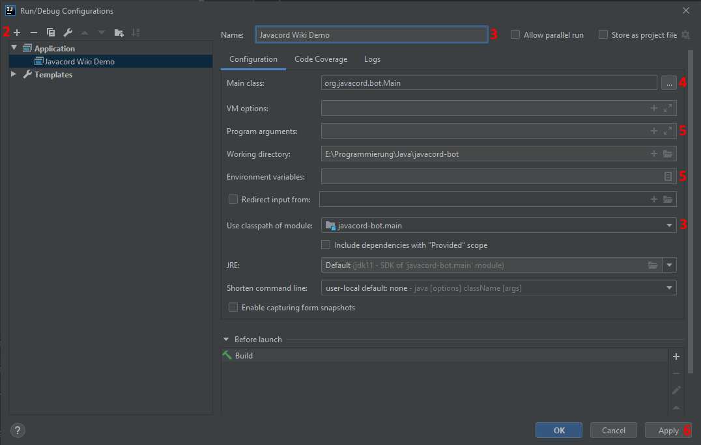
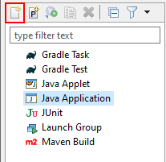
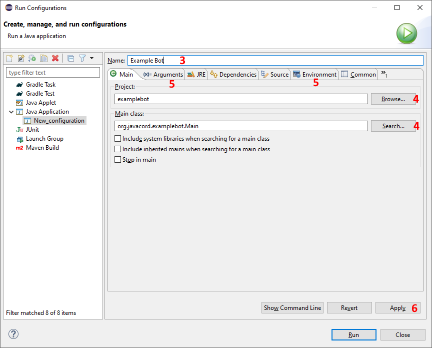
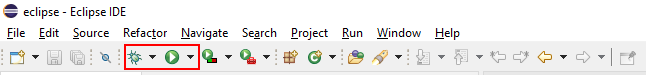

---
keywords:
- run bot
- running bot
- execute bot
- deploy
- deployment
- application
---


# Running and Deploying your Bot

If you took the time to write a bot, at some point you'll also want to run it, either for use in production or for debugging from the IDE.

## :construction_worker: Running from your IDE

While developing your bot, you will want to run your bot directly from the IDE in order to quickly test changes and new features. For this, create a Run/Debug Configuration in your IDE of choice with your bot's main class. Remember to also add any necessary parameters and environment variables.

A working Run/Debug configuration will also enable you to run your bot with a debugger. A debugger is often considered a developer's most important tool, so make sure to familiarize yourself with the debugging integration for your IDE of choice.

### IntelliJ IDEA

This assumes your project is set up correctly, preferably with [Gradle](/wiki/getting-started/intellij-gradle), can be built without errors, and does not yet have any run/debug configurations.

**1.** Locate and click the `Add Configuration...` button in the top bar next to the start button.


**2.** In the newly opened window, click the `+` button in the top left and select `Application`

**3.** Give a name for your configuration and select the module to use the classpath of (usually `yourproject.main`).

**4.** Select your Main class. Use the `...` button to search for it or provide the fully qualified name. If it can not be found, you most likely selected the wrong module in step 3.

**5.** Optional: Set command line arguments and environment variables. For the environment variables, use the button to the right of the input field for a more convenient input window.

**6.** Click `Apply` to finalize the configuration, then `OK` to close the window.



**7.** Select your configuration in the drop-down menu and run or debug it with the buttons to the right.


### Eclipse

This assumes your project is set up correctly, can be built without errors, and does not yet have any run/debug configurations.

**1.** In the menu bar, click "Run" then "Run Configurations...".

**2.** In the newly opened window, select "Java Application" on the left side, then click the leftmost button in the row above the tree view. A new configuration will appear.



**3.** Give a name to your configuration.

**4.** Set the project and the main class. To easily select it, use the "Browse..." and "Search..." buttons.

**5.** Optional: Set command line (and VM) arguments as well as environment variables in their respective tabs.

**6.** Click `Apply` to save your configuration, then `Close` to close the window.



**7.** Run or debug your bot via the Buttons in the top row, the `Run` menu, or the shortcuts Ctrl+F11 for running and F11 for debugging.



## :package: Deploying and Running as a Standalone Application

Running from the IDE is only recommended during development and strongly discouraged for production use. Generally, you'll want your build tool to create a convenient distribution format for you to use.

### Building a Distribution with Gradle
<LatestVersion/>

For Gradle, only two further steps are necessary for a basic application. On top of the steps described in the [Getting Started Section](/wiki/getting-started/intellij-gradle), also add the [Application Plugin](https://docs.gradle.org/current/userguide/application_plugin.html) and define your `mainClass` as the fully qualified name of your main class. If you're using an older version of Gradle (earlier than 6.4), the attribute is instead called `mainClassName`.

::: tip INFO
As with many Gradle solutions, there is actually a whole lot going on under the hood. The `application` plugin implicitly also applies the `java` and `distribution` plugins. Refer to the documentations of the involved plugins for more ways to fine-tune the process.
:::

Your modified build file should now look similar to this:

<CodeGroup>
  <CodeGroupItem title="build.gradle.kts" active>

```kts
plugins {
    application
}
 
version = "1.0.0"
 
java {
    sourceCompatibility = JavaVersion.VERSION_1_8
}
 
application {
    mainClass.set("com.github.yourname.BotMain")
    // mainClassName.set("com.github.yourname.BotMain")  // Gradle < 6.4
}
 
repositories {
    mavenCentral()
}
 
dependencies {
    implementation("org.javacord:javacord:{{latestVersion}}")
}
```

  </CodeGroupItem>

  <CodeGroupItem title="build.gradle">

```groovy
plugins {
    id 'application'
}
 
version '1.0.0'
 
java {
    sourceCompatibility = JavaVersion.VERSION_1_8
}
 
application {
    mainClass = 'com.github.yourname.BotMain'
    // mainClassName = 'com.github.yourname.BotMain' // for Gradle versions < 6.4
}
 
repositories {
    mavenCentral()
}
 
dependencies {
    implementation 'org.javacord:javacord:{{latestVersion}}'
}
```

  </CodeGroupItem>

</CodeGroup>

Now you can execute the `distZip` or `distTar` task with Gradle. The task will create a distribution and package it in an archive file that will be placed in the `build/distributions` directory. Extract the content of those files on your server or whichever machine you want to run your bot on.

The distribution usually only contains the directories `bin` and `lib`. From the distribution directory, run either `bin/yourbot` or `bin/yourbot.bat`, depending on whether you're running the bot on Linux / macOS or windows.

### Building a Distribution with Maven

For Maven, add the [Appassembler](https://www.mojohaus.org/appassembler/appassembler-maven-plugin/usage-program.html) plugin to your `pom.xml`. The plugin will create a distribution, but not bundle it in a neat archive file, so we'll also add the assembly plugin. We'll bind both to the `package` lifecycle phase.

```xml
<project>
  ...
    <build>
        <plugins>
            <plugin>
                <groupId>org.codehaus.mojo</groupId>
                <artifactId>appassembler-maven-plugin</artifactId>
                <version>1.10</version>
                <configuration>
                    <programs>
                        <program>
                            <mainClass>org.javacord.examplebot.Main</mainClass>
                            <id>examplebot</id>
                        </program>
                    </programs>
                </configuration>
                <executions>
                    <execution>
                        <id>create-distribution</id>
                        <phase>package</phase>
                        <goals>
                            <goal>assemble</goal>
                        </goals>
                    </execution>
                </executions>
            </plugin>
            <plugin>
                <artifactId>maven-assembly-plugin</artifactId>
                <version>3.3.0</version>
                <configuration>
                    <descriptors>
                        <!-- This must match the location of the descriptor -->
                        <descriptor>src/assembly/distribution.xml</descriptor>
                    </descriptors>
                </configuration>
                <executions>
                    <execution>
                        <id>create-archive</id>
                        <phase>package</phase>
                        <goals>
                            <goal>single</goal>
                        </goals>
                    </execution>
                </executions>
            </plugin>
        </plugins>
    </build>
</project>
```

Sadly, none of the built-in assembly descriptors match our use case, so we'll put our custom one into `src/assembly/distribution.xml`: 

```xml
<assembly xmlns="http://maven.apache.org/plugins/maven-assembly-plugin/assembly/1.1.2" xmlns:xsi="http://www.w3.org/2001/XMLSchema-instance"
          xsi:schemaLocation="http://maven.apache.org/plugins/maven-assembly-plugin/assembly/1.1.2 http://maven.apache.org/xsd/assembly-1.1.2.xsd">
    <id>distribution</id>
    <formats>
        <!-- See https://maven.apache.org/plugins/maven-assembly-plugin/assembly.html for supported formats -->
        <format>tar.gz</format>
        <format>tar.bz2</format>
        <format>zip</format>
    </formats>
    <fileSets>
        <fileSet>
            <!-- This will also include your project readme, license and similar files-->
            <directory>${project.basedir}</directory>
            <outputDirectory>/</outputDirectory>
            <includes>
                <include>README*</include>
                <include>LICENSE*</include>
                <include>NOTICE*</include>
            </includes>
        </fileSet>
        <fileSet>
            <!-- Change this if you reconfigured the appassembler output directory -->
            <directory>${project.build.directory}/appassembler</directory>
            <outputDirectory>/</outputDirectory>
        </fileSet>
    </fileSets>
</assembly>
```

Now when you execute `mvn package`, a distribution with start scripts for Windows and Linux/macOS will be generated which is then packaged into archive files for every format you specified in the assembly descriptor. You can find the raw distribution (without readme and license files) in `target/appassembler` and the archive files directly in `target`.

### Running

After creating your distribution via Gradle or Maven and extracting/copying it to the machine you want to run it from, you should have a directory containing both a `bin` and a `lib` (or `repo`) directory. Depending on your platform, you can now run the `bin/yourbot` or `bin/yourbot.bat` script.

These automatically generated scripts will then invoke java with your dependencies on the classpath and run your main class. Your working directory will be the directory you ran the script from.

## :poop: Building a Fat Jar

Although it is an abuse of the way java works, sometimes you will be forced to create a fat jar, or an uber jar. This is a jar file that contains your application and all its dependencies. This is sometimes used as a lazy way of building a convenient distribution, but should be foregone in favor of the above mentioned distributions.

However, in some cases (more often than not Bukkit/Spigot addons) it is necessary to provide a fat jar, since the host application's loading mechanism can only handle singular jar files. If you are subject to such a case of bad design, please complain to the maintainer of whatever host application you are using, then use the following instructions to forsake all that is good and just and create a fat jar. Remember to grit your teeth the whole time.

### With Gradle

For Gradle, use the [shadow](https://github.com/johnrengelman/shadow) plugin. If you want the fat jar to be executable, you will need to specify a main class via the application plugin.

```groovy
plugins {
    id 'java'
    # ...
    id 'com.github.johnrengelman.shadow' version '7.1.2'
}
```

With `gradlew shadowJar` you can now create a shaded (fat) jar. It will be named `build/libs/yourbot-1.0.0-all.jar` or similar, according to your project settings.

### With Maven

For Maven, add the [maven-shade-plugin](https://maven.apache.org/plugins/maven-shade-plugin/usage.html) to your build. As with the other solutions, configure your main class.

Some of your dependencies might be signed .jar files. Unfortunately, this will likely break your fat jar. Remove the signatures by defining an exclusion filter as demonstrated below. Let the thought that you had to disable a security feature just to make this work serve as a reminder that creating a fat jar is not how jars are meant to be used.

```xml
<project>
  ...
  <build>
    <plugins>
      <plugin>
        <groupId>org.apache.maven.plugins</groupId>
        <artifactId>maven-shade-plugin</artifactId>
        <version>3.2.3</version>
        <configuration>
            <shadedArtifactAttached>true</shadedArtifactAttached>
            <shadedClassifierName>fat</shadedClassifierName>
            <transformers>
                <transformer implementation="org.apache.maven.plugins.shade.resource.ManifestResourceTransformer">
                    <manifestEntries>
                       <Main-Class>com.github.yourname.BotMain</Main-Class>
                    </manifestEntries>
                </transformer>
            </transformers>
            <filters>
                <filter>
                    <artifact>*:*</artifact>
                    <excludes>
                        <exclude>META-INF/*.SF</exclude>
                        <exclude>META-INF/*.DSA</exclude>
                        <exclude>META-INF/*.RSA</exclude>
                    </excludes>
                </filter>
            </filters>
        </configuration>
        <executions>
          <execution>
            <phase>package</phase>
            <goals>
              <goal>shade</goal>
            </goals>
          </execution>
        </executions>
      </plugin>
    </plugins>
  </build>
</project>
```

Running `mvn package` will now additionally create the `yourbot-1.0.0-fat.jar`.
