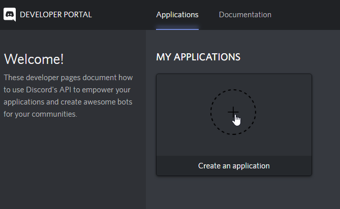
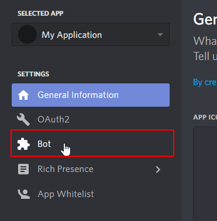
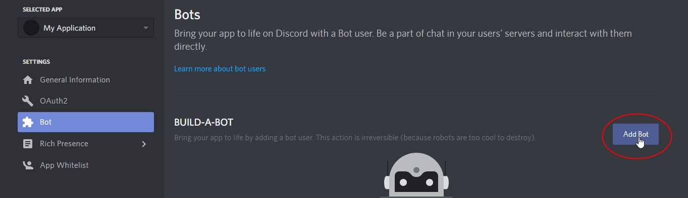
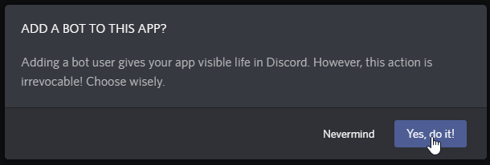
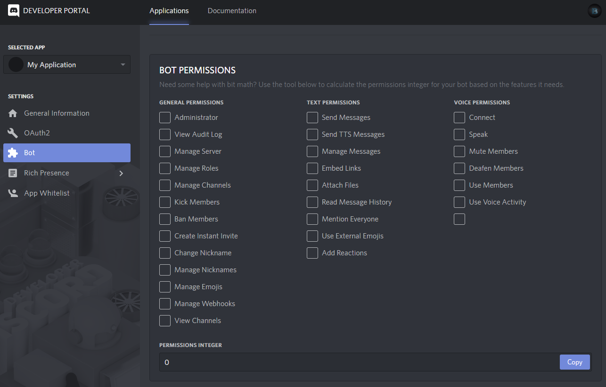

---
keywords:
- bot creation
- get token
- add bot
- bot invite link
---

# Creating a Bot Account

After you added Javacord as a dependency with your favorite build manager, you should now create a bot account on the Discord website.
This article will guide you through the process.

## :bulb: Create a bot and get its token

#### **1.** Open [https://discord.com/developers/applications/me](https://discordapp.com/developers/applications/me) and click on "Create an application".



#### **2.** Switch to `Bot`

::: tip
If you want to, you can rename your application first
::: 



#### **3.** Click on `Add bot` and confirm the popup




#### **4.** Copy the bot's token. In this case the token would be `NDc[...]pCs`. You can just click on `Copy`.

::: danger
This token is used to login your bot. Keep it secret!
:::


#### **5.** If you want to, you can change the bot's name and avatar on this page, too.

## :heavy_plus_sign: How to add a bot to your server

Bots cannot join a server on their own like normal Discord users can.
Instead the owner of a sever has to invite the bot using a so called `Invite Link`.
There are multiple ways to create the invite link:

### Use Javacord to create the invite link

The easiest way to obtain an invite link for you bot is by letting Javacord do it for you.
Simply execute the following code and it will print the invite link to your console:

```java
DiscordApi api = new DiscordApiBuilder().setToken("your token").login().join();
System.out.println(api.createBotInvite());
```

If you don't have Javacord setup yet, you can also create the invite link manually.

### Create the invite link manually

#### Get the client id

In order to add a bot to your server you need its client id.

You can get your client id from the [same page](https://discord.com/developers/applications/me) where you created it.


With this id you can create an invite link for your bot.

If you are the owner or admin of the server, you can use this link to add your bot to your server. Otherwise, you have to give the link to the server owner/admins and ask them to add your bot.

::: tip
Unlike the token, you don't have to keep your client id secret
:::

#### Create the url

Just use the following link and replace `123456789` with your own client id.

**https://discord.com/api/oauth2/authorize?client_id=123456789&scope=bot&permissions=0**

You can calculate the permissions (in the link above it's the `0`) on the page where you created the bot:



## :raising_hand_man: Use the invite link

You can now open the link and add the bot to your server:


::: tip
Only the owner and admins of a server can invite bots. If you do not own a server yet, it is recommended to create one for testing.
::: 